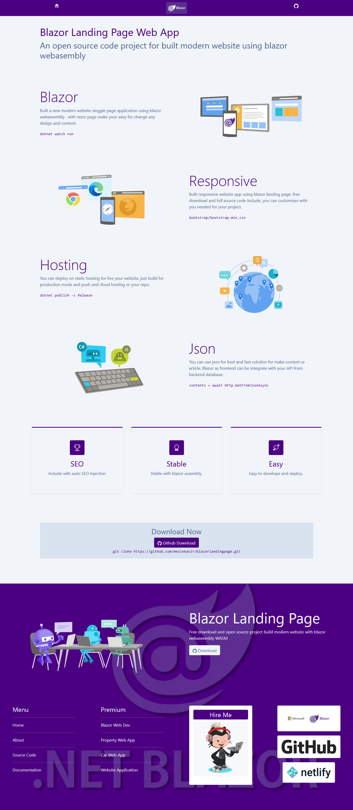

# Blazor WASM Landing Page

blazor webassembly landing page

Demo : [https://blazorlandingpage.netlify.app](https://blazorlandingpage.netlify.app)

Demo Purple : [https://blazordev.web.app/](https://blazordev.web.app/)

Documentation [https://www.hockeycomputindo.com/2022/10/blazor-wasm-landing-page-webassembly.html](https://www.hockeycomputindo.com/2022/10/blazor-wasm-landing-page-webassembly.html)

Template Source code 2 : [https://www.hockeycomputindo.com/2022/10/free-download-blazor-webassembly-seo.html](https://www.hockeycomputindo.com/2022/10/free-download-blazor-webassembly-seo.html)

--------

Display design

--------

Demo : [https://blazorlandingpage.netlify.app](https://blazorlandingpage.netlify.app)

Demo Purple : [https://blazordev.web.app/](https://blazordev.web.app/)

Documentation [https://www.hockeycomputindo.com/2022/10/blazor-wasm-landing-page-webassembly.html](https://www.hockeycomputindo.com/2022/10/blazor-wasm-landing-page-webassembly.html)

Template Source code 2 : [https://www.hockeycomputindo.com/2022/10/free-download-blazor-webassembly-seo.html](https://www.hockeycomputindo.com/2022/10/free-download-blazor-webassembly-seo.html)

